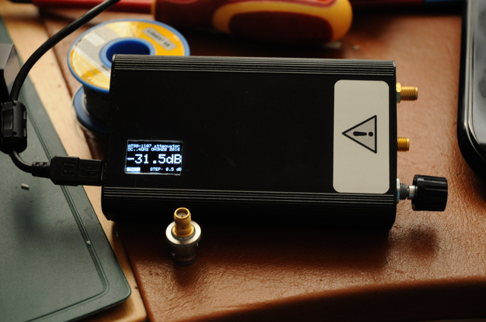

# RF-step-attenuator
Arduino code to control AT90-1107 digital RF step attenuator (OLED + rotary encoder GUI)

Hardware: AT90-1107 evaluation board + Arduino nano + SSD1306 OLED + rotary encoder.
See the pinout from the source code.

Lasse OH3HZB 2016

